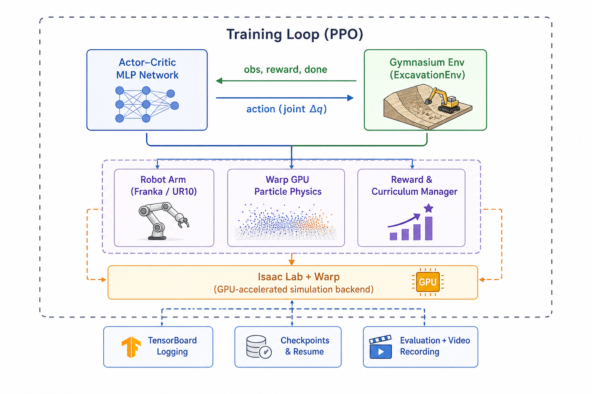
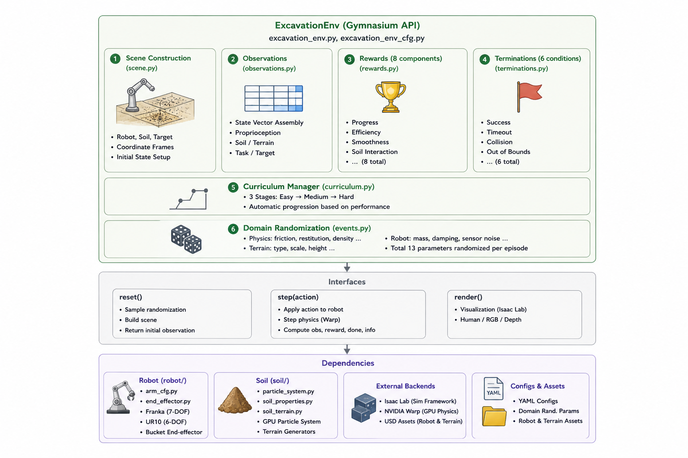
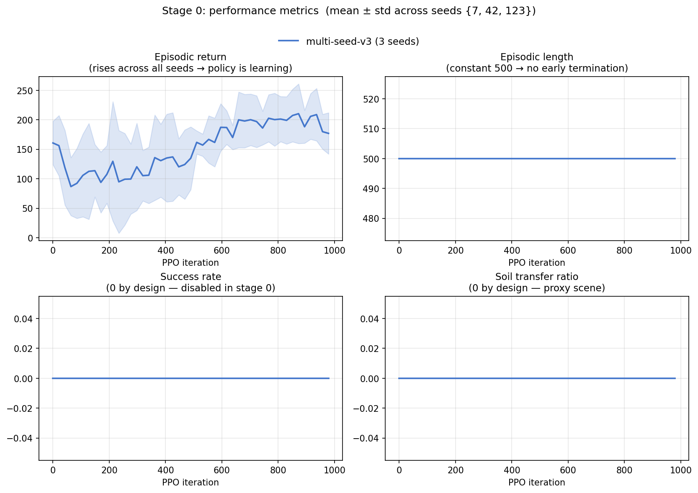
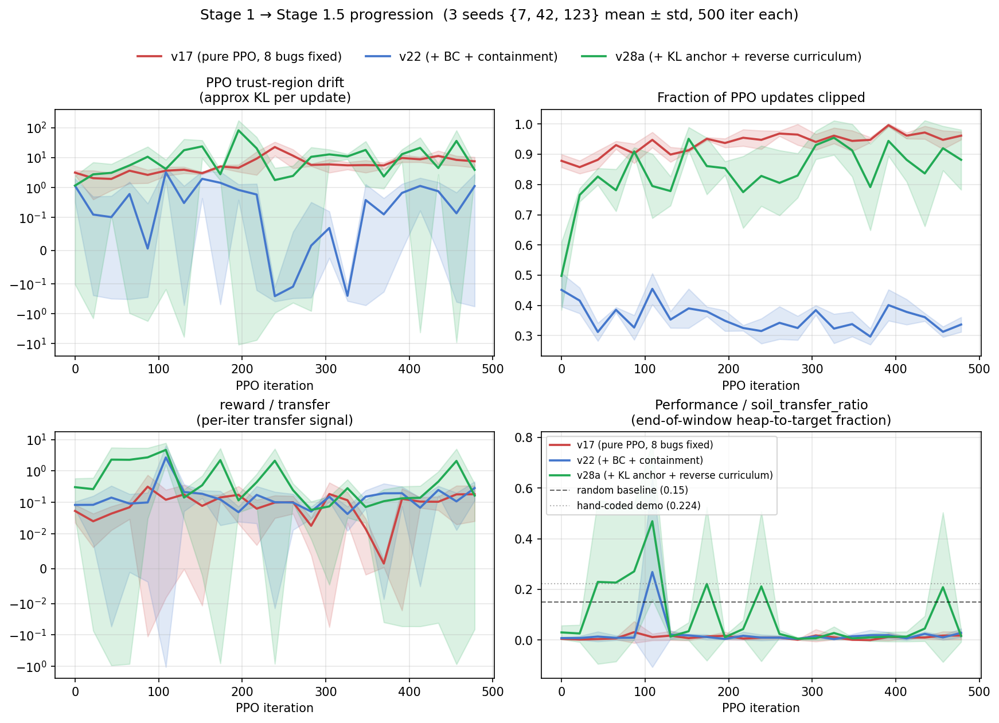

# excavation-rl — Diagnostic Case Study in RL for Granular Manipulation

> **ETH Zurich — Robotic Systems Lab (RSL), Semester Project**
> **This is Part 2 of a three-repository research portfolio.** Each repo is independent; this README is written so it stands alone.

**Portfolio context:**

1. **Part 1** — [`isaac-lab-manipulation`](https://github.com/Yang251552/isaac-lab-manipulation) — production-framework competency (works end-to-end on a standard Isaac Lab manipulation benchmark).
2. **Part 2 — this repo** — a deliberate difficulty jump into granular-media excavation. *The project did not converge to a passing policy in my hardware / time budget; the deliverable is the diagnosis of why, and under what conditions it would.* The bug catalogue, tuning logs, and PASS-gate framework are the substance — not the training curves.
3. **Part 3** — [`cluttered-lift`](https://github.com/Yang251552/cluttered-lift) — same granular-manipulation interest, re-approached on the engineering budget Part 2 was missing. Instead of custom Warp particles and a custom PPO stack, it uses Isaac Lab + `rsl_rl` and a locked rigid-body sphere cluster around the standard Lift-Cube task. The point is narrower than "solve excavation": ask whether the act-1 lifting policy transfers, whether PPO can learn from scratch on the contact-rich proxy, and whether a warm start changes the failure mode. Same research taste as Part 2, different engineering budget.

**Headline finding (full reasoning in [`docs/retrospective.md`](docs/retrospective.md)):**

This repo trains a Franka arm with a bucket end-effector to scoop, transport, and deposit granular soil simulated as 200–500 GPU particles via NVIDIA Warp, optimised with custom PPO + behavioural-cloning warm-start + KL anchor + reverse-curriculum reset. Across 30+ versions in five campaign families (v17 → v22 → v25–v28 → v28b → v31), the best run reaches **26.7 % mean soil-transfer ratio across 3 fresh seeds (1.8× random baseline)** — but **FAILs the §5 PASS gate**: transfer ✅, cross-seed CoV ✅, but `Policy/approx_kl = 585 408`, `clip_fraction = 0.998`, `explained_variance = −0.20` all far outside healthy PPO. The diagnosis: BC pretraining drives `action_std` toward zero, which makes the analytic Gaussian KL explode during PPO updates; transfer holds because the policy is faithfully mimicking BC, not because PPO is optimising. v31 on fresh seeds {500, 555, 999} confirms the mechanism reproduces (v28a's seed 123 reaching 28.5 % was not a tail event), so the blocker is at the BC-PPO interaction level, not seed variance. Conditions that would unblock this excavation formulation — an entropy floor + softer anchor, a more faithful bucket/soil collision model, and a recalibrated KL gate threshold — are documented in the [retrospective](docs/retrospective.md).

**How to read this repo:** the technical sections below ([Environment Design](#environment-design), [Training Pipeline](#training-pipeline), [Stage 0/1 Results](#training-pipeline)) are the engineering substrate of the diagnosis. The [retrospective](docs/retrospective.md) is the research artefact — what I attempted, what failed, where it stuck, what conditions would unblock it, what I'd do differently. Read the retrospective if you have only a few minutes.

---

## Table of Contents

- [Motivation](#motivation)
- [System Architecture](#system-architecture)
- [Project Structure](#project-structure)
- [Installation](#installation)
- [Quick Start](#quick-start)
- [Task Description](#task-description)
- [Environment Design](#environment-design)
  - [Observation Space](#observation-space)
  - [Action Space](#action-space)
  - [Reward Function](#reward-function)
  - [Termination Conditions](#termination-conditions)
- [Training Pipeline](#training-pipeline)
  - [PPO Implementation](#ppo-implementation)
  - [Multi-Stage Training](#multi-stage-training)
  - [Stage 0 Results](#stage-0-results)
  - [Stage 1 Results](#stage-1-results)
  - [Curriculum Learning](#curriculum-learning)
  - [Domain Randomization](#domain-randomization)
- [Particle Physics Simulation](#particle-physics-simulation)
- [Evaluation & Analysis](#evaluation--analysis)
  - [Quantitative Metrics](#quantitative-metrics)
  - [Ablation Studies](#ablation-studies)
- [Configuration System](#configuration-system)
- [Design Decisions & Rationale](#design-decisions--rationale)
- [What This Repo Contains](#what-this-repo-contains)
- [References](#references)

---

## Motivation — Why Excavation Was Chosen for This Portfolio Slot

Autonomous excavation sits beyond the "just plug in PPO" regime that polished benchmarks like Lift-Cube or Push-T cover. Granular-media manipulation involves continuous deformable interactions between a tool and a deformable medium — there is no closed-form contact model, the per-step dynamics are stochastic, and the bucket / heap geometry interact in ways that make standard reward shaping reverse direction (see [Stage 1 Results](#stage-1-results), bug #8).

I chose this task **for Part 2 of the portfolio precisely because it surfaces failure modes that polished benchmarks hide**. The point was not to ship an excavation policy in one semester — that target was understood to be aspirational from the outset, given my hardware budget (single A10G EC2) and time budget (the semester project window). The point was to use excavation as a stress test for my own RL workflow: does it produce credible diagnostics when training fails, or does it produce hand-waved excuses?

What this repository contains is the answer to that question. The 10-bug catalogue, the 30+ version tuning logs, the multi-seed reproducibility verification, and the §5 PASS-gate framework (codified in [`CLAUDE.md`](CLAUDE.md)) together constitute a worked example of *how I diagnose RL failure*. The retrospective in [`docs/retrospective.md`](docs/retrospective.md) is where I lay out my own judgement calls — including the ones I'd reverse if I did this again. The hand-coded scoop demo (22.4 % transfer per replay) and v31's 26.7 % mean transfer establish that the task is structurally solvable in this physics; the failure is at the BC-PPO interaction level, not at "RL is too weak for this task".

Long-term sim-to-real transfer to physical excavation hardware remains the ultimate research direction this work *would* serve — but Part 3 of the portfolio addresses the next step more carefully: the granular-manipulation interest is preserved, but pursued inside the production stack instead of on a self-built substrate, so the measured signal is the learning failure rather than the cost of bespoke infrastructure. See the [portfolio context](#excavation-rl--diagnostic-case-study-in-rl-for-granular-manipulation) at the top of this README for how Part 3 inherits the granular-media question while reducing the infrastructure surface.

---

## System Architecture



> **Note:** the "Isaac Lab + Warp" simulation backend block in this diagram is the **target architecture**, not the current one. The current implementation uses Warp directly for GPU particle physics on top of a custom standalone numpy backend; Isaac Lab integration (articulation kinematics, scene graph, USD assets, GPU-parallel envs) is one of the conditions that would unblock further work — see [`docs/retrospective.md`](docs/retrospective.md) §4. The Gymnasium env API, PPO training loop, wandb / TensorBoard logging, checkpointing, and evaluation tooling are all in place today.

---

## Project Structure

```
excavation-rl/
├── envs/                          # RL Environment (Gymnasium API)
│   ├── excavation_env.py          # ExcavationEnv + VecExcavationEnv
│   ├── excavation_env_cfg.py      # Hierarchical dataclass configuration
│   ├── scene.py                   # Scene construction (robot, soil, target)
│   ├── observations.py            # Observation vector assembly
│   ├── rewards.py                 # 10-component reward function (9 weighted + 1 terminal success bonus)
│   ├── terminations.py            # 6 termination conditions
│   ├── curriculum.py              # 3-stage curriculum manager
│   └── events.py                  # Domain randomization (13 parameters)
│
├── soil/                          # GPU Particle Physics (NVIDIA Warp)
│   ├── particle_system.py         # Warp kernels + ParticleSystem class
│   ├── soil_properties.py         # 5 soil material presets (sand, clay, etc.)
│   └── soil_terrain.py            # Heap generators (cone, hemisphere, cylinder, flat)
│
├── robot/                         # Robot Arm Configuration
│   ├── arm_cfg.py                 # Franka Panda (7-DOF) & UR10 (6-DOF) configs
│   └── end_effector.py            # Bucket end-effector geometry
│
├── training/                      # PPO Training Pipeline
│   ├── train.py                   # ActorCritic network + PPOTrainer + entry point
│   ├── ppo_cfg.py                 # Per-stage hyperparameter configs
│   └── callbacks.py               # TensorBoard logger + checkpoint manager
│
├── evaluation/                    # Post-Training Analysis
│   ├── evaluate.py                # Multi-seed quantitative evaluation
│   ├── metrics.py                 # EpisodeMetrics & EvaluationReport
│   ├── ablation.py                # Systematic ablation experiment runner
│   ├── visualize.py               # Training curve & comparison plots
│   └── record_video.py            # Episode video recording (MP4)
│
├── configs/                       # YAML Configuration Files
│   ├── base.yaml                  # Master configuration
│   ├── reward_ablation.yaml       # Reward component ablation variants
│   └── dr_ablation.yaml           # Domain randomization ablation variants
│
├── tests/                         # Unit Tests
│   ├── test_env.py                # Gymnasium API, observation bounds, rollout
│   ├── test_soil.py               # Particle system, terrain, height maps
│   └── test_reward.py             # Reward computation, weights, batching
│
├── assets/                        # Robot & Terrain USD Assets
├── results/                       # Output (auto-created)
│   ├── training_curves/           # TensorBoard logs
│   ├── checkpoints/               # Model checkpoints
│   ├── videos/                    # Recorded evaluation episodes
│   ├── figures/                   # Generated plots
│   └── ablation_reports/          # Ablation results (JSON)
│
├── requirements.txt
└── setup.py
```

---

## Installation

### Prerequisites

| Requirement | Version |
|---|---|
| Python | 3.10+ |
| NVIDIA GPU | CUDA-capable (compute capability 7.0+) |
| Isaac Sim | 4.x (for full simulation mode; not needed for Stage 0) |
| Isaac Lab | Installed as Isaac Sim extension |

### Setup

```bash
# Clone the repository
git clone <repository-url>
cd excavation-rl

# Install the package and dependencies
pip install -e ".[dev]"

# Install rsl_rl (RSL reinforcement learning library)
git clone https://github.com/leggedrobotics/rsl_rl.git
cd rsl_rl && pip install -e . && cd ..

# Install NVIDIA Warp (if not bundled with Isaac Sim)
pip install warp-lang
```

### Key Dependencies

| Package | Purpose |
|---|---|
| `torch >= 2.1.0` | Neural network training (PPO actor-critic) |
| `numpy >= 1.24.0` | Numerical computation |
| `warp-lang` | GPU-accelerated particle physics |
| `rsl_rl` | RL training library (RSL conventions) |
| `tensorboard >= 2.14.0` | Training metric visualization |
| `matplotlib >= 3.7.0` | Evaluation plots |
| `imageio >= 2.31.0` | Video recording |
| `pyyaml >= 6.0` | YAML config parsing |
| `pytest >= 7.0` | Unit testing |

---

## Quick Start

### Stage 0 — Pipeline Validation (No Isaac Sim Required)

Validates the full training pipeline (PPO + custom env + wandb logging + checkpointing) on a simplified positional reward. See [Stage 0 Results](#stage-0-results) below for details.

```bash
# Single run with wandb logging
python -m training.train --stage 0 --wandb \
    --wandb-project excavation-rl \
    --wandb-run-name stage0_v3_seed42 --seed 42 \
    --max-iterations 1000

# Multi-seed reproducibility study (3 seeds in parallel)
for SEED in 7 42 123; do
    PYTHONUNBUFFERED=1 nohup python -m training.train --stage 0 --wandb \
        --wandb-project excavation-rl \
        --wandb-run-name stage0_v3_seed${SEED} --seed ${SEED} \
        --max-iterations 1000 --wandb-tags multi-seed-v3 \
        > logs/v3_seed${SEED}.log 2>&1 &
done

# Run unit tests
pytest tests/ -v
```

### Stage 1 — Particle System Training

Trains with the Warp GPU particle simulation (200–500 particles). This is the campaign that produced the v17 → v22 → v28a → v31 results documented in [Stage 1 Results](#stage-1-results); the actual flags used in those runs are in [`docs/stage1_results_appendix.md`](docs/stage1_results_appendix.md) (reproducibility section), not the simplified command below.

```bash
python -m training.train --stage 1 --num-envs 32 --max-iterations 1000
```

### Stage 2 (not reached)

Stage 2 (curriculum + domain randomization) was the original plan but was **never run** — Stage 1.5 did not pass the §5 gate, so Stage 2 entry was never authorised. The CLI scaffolding exists (the configs, the curriculum manager, the event manager all run), so a future contributor can launch it; the diagnosis in [`docs/retrospective.md`](docs/retrospective.md) §4 explains why running it now would not be informative without first fixing the BC-PPO interaction issue.

```bash
# This command runs but is not validated; not part of the diagnostic record.
python -m training.train --stage 2 --max-iterations 2000 --seed 42
```

### Resume from Checkpoint

```bash
python -m training.train --stage 1 --resume results/checkpoints/model_000500.pt
```

### Monitor Training

```bash
tensorboard --logdir results/training_curves
```

---

## Task Description

The agent must complete a full excavation cycle within 500 timesteps:

1. **Approach** — Move the bucket end-effector toward the soil heap
2. **Scoop** — Penetrate the heap and collect soil particles into the bucket
3. **Transport** — Carry the loaded bucket to the target deposit zone
4. **Dump** — Release the soil into the target zone

**Success criterion:** Transfer ≥ 80% of the total soil mass from the heap into the target zone.

### Scene Layout

| Element | Position | Parameters |
|---|---|---|
| Robot base | `(0, 0, 0)` | Franka 7-DOF or UR10 6-DOF |
| Soil heap | `(0.5, 0.0, 0.05)` | Radius 0.12 m, height 0.15 m, cone shape |
| Target zone | `(0.4, 0.3, 0.05)` | Half-extent `[0.12, 0.12, 0.2]` m |
| Ground plane | `z = 0` | — |

---

## Environment Design



> **Note:** the diagram labels rewards as "8 components" — the implementation has since grown to **10 components** (9 weighted dense terms + 1 terminal success bonus); see the [Reward Function](#reward-function) table for the canonical list. The `Isaac Lab` block under External Backends is also still part of the target architecture, not a current dependency.

The environment follows the Gymnasium API and supports vectorized parallel execution via `VecExcavationEnv`. The six numbered subsystems above map to the subsections that follow.

### Observation Space (66 dimensions)

| Group | Components | Dimensions |
|---|---|---|
| Joint positions | `q_1 ... q_7` | 7 |
| Joint velocities | `dq_1 ... dq_7` | 7 |
| End-effector position | `(x, y, z)` | 3 |
| End-effector orientation | Quaternion `(w, x, y, z)` | 4 |
| End-effector linear velocity | `(vx, vy, vz)` | 3 |
| End-effector angular velocity | `(wx, wy, wz)` | 3 |
| Bucket load | Normalized mass `[0, 1]` | 1 |
| Bucket contact force | `(Fx, Fy, Fz)` | 3 |
| Soil height map | 5 x 5 grid | 25 |
| Target position | `(x, y, z)` | 3 |
| Previous action | `a_{t-1}` | 7 |
| **Total** | | **66** |

The soil observation mode is configurable: `height_map` (default, 25D), `centroid` (7D: position + spread + ratio), or `none`.

### Action Space

| Property | Value |
|---|---|
| Type | Continuous joint position deltas |
| Dimensions | 7 (Franka) or 6 (UR10) |
| Raw range | `[-1, +1]` |
| Scaled range | `[-0.1, +0.1]` rad per step |
| Rate limiting | Max change of 1.0 in normalized space per step |

### Reward Function

The reward function consists of **10 components**: 9 individually weighted dense terms plus a one-time terminal success bonus. Each component is computed and logged separately, enabling fine-grained ablation analysis.

> **Note:** the table below shows the **stage-1 v22 weights** (the configuration that produced the [Stage 1 Results](#stage-1-results)). Stage 0 uses a simplified single-component subset (`approach` only, all other weights = 0 and `success_bonus = 0`) for pipeline validation — see [Stage 0 Results](#stage-0-results). Stage 2 will reintroduce the binary penalties (R6, R8) as graduated penetration-depth signals.

| # | Component | Stage-1 Weight | Formula | Purpose |
|---|---|---|---|---|
| R1 | **Soil transfer** | `+10.0` | `w₁ · Δ(soil_in_target_ratio)` | Primary task objective |
| R2 | **Approach** | `+1.0` | `w₂ · exp(-α · ‖ee - heap_center‖)` | Guide EE toward heap (static heap centre) |
| R3 | **Bucket load** | `+10.0` | `w₃ · normalized_load` | Incentivise scooping |
| R4 | **Transport** | `+3.0` | `w₄ · load · exp(-α · ‖ee - target‖)` | Guide loaded bucket to target |
| R5 | **Smoothness** | `-0.001` | `w₅ · ‖aₜ - aₜ₋₁‖²` | Small penalty on action discontinuities |
| R6 | **Joint limit** | `0.0` (stage 1) | `w₆ · Σ violations` | Disabled in stage 1; binary signal produced bimodal returns. Re-enabled in stage 2 |
| R7 | **Time** | `-0.01` | `w₇` (per step) | Encourage efficiency |
| R8 | **Collision** | `0.0` (stage 1) | `w₈` (if collision) | Disabled in stage 1 (same reason as R6); stage 2 will use `-k · max(0, -ee_z)` |
| R9 | **Dig depth** | `+0.5` | `w₉ · exp(-β · max(0, ee_z - dig_target_z))` | Dense vertical-descent shaping (`dig_target_z = 0.07 m`, `β = 8`) |
| **Bonus** | **Success** | `+5.0` | One-time, if `transfer_ratio ≥ 0.3` | Terminal completion bonus |

where `α = 2.0` is the exponential decay rate for distance-based shaping. The provenance of each weight (when it was added, what it was tuned from) is recorded in [`docs/stage1_tuning_log.md`](docs/stage1_tuning_log.md).

### Termination Conditions

| Condition | Type | Trigger | Stages |
|---|---|---|---|
| Success | Terminal | `soil_in_target_ratio ≥ success_threshold` (0.8 in Stage 1/2; **1.01 ≡ disabled** in Stage 0) | 1, 2 |
| Timeout | Truncation | `step ≥ 500` | 0, 1, 2 |
| Joint limit | Terminal | Joint position outside limits ± 0.01 rad | 0, 1, 2 |
| Ground penetration | Terminal | Bucket `z < -0.02 m` | 0, 1, 2 |
| Base displacement | Terminal | Robot base moved > 0.01 m | 0, 1, 2 |

In Stage 0 the success threshold is set to an unreachable value (1.01) so that the proxy scene's noisy `get_soil_in_target_ratio()` heuristic does not accidentally fire SUCCESS termination — this keeps `episodic_length` constant at 500 and produces clean value-loss curves.

---

## Training Pipeline

### PPO Implementation

A custom Proximal Policy Optimization implementation compatible with `rsl_rl` conventions.

**Actor-Critic Network:**

```
Policy:  obs(66D) → [256] → ELU → [256] → ELU → [128] → ELU → action_mean(7D)
Value:   obs(66D) → [256] → ELU → [256] → ELU → [128] → ELU → value(1D)
```

- Separate policy and value heads (no shared backbone)
- Gaussian policy with learnable per-action log-std
- Orthogonal weight initialization (gain = √2)
- **Observation normalization (`RunningMeanStd`)** wraps every input to both heads. Welford-style running mean and variance are accumulated across rollouts; observations are normalised as `(obs - mean) / sqrt(var + eps)` at every forward pass. Without this, the 66-dimensional mixed-unit observation (radians + meters + dimensionless ratios + height-map cells) produced KL ≈ 7-13 with `clip_fraction > 0.95` across stage-1 v1-v10, regardless of LR or entropy tuning. Adding the normaliser dropped early-training KL to ~0.2 — see [Stage 1 Results](#stage-1-results) bug #3.

**KL-based PPO early stopping:** in addition to the surrogate clip, each PPO update breaks out of the epoch loop when `approx_kl > 2 × desired_kl` on a mini-batch. Prevents the rare-but-catastrophic KL spikes (observed up to 22 820 in v18 seed 123) from destroying the policy. The tighter `2×` threshold (vs. the SB3-default `4×`) was selected after v17/v18 ablation showed `4×` allowed slow KL drift over 500 iterations.

**Behavioural-cloning warm-start (`--bc-data PATH --bc-steps N`):** before the PPO loop, the trainer loads `(obs, action)` pairs from a `.npz` and runs `N` MSE updates of the policy mean against the demo actions. The same observations also warm up `RunningMeanStd` so PPO starts with calibrated normalisation statistics. Generated demos come from `scripts/generate_bc_demos.py` running `scripts/scoop_demo.py`'s parametric 5-phase scoop trajectory across 32 noise-perturbed seeds (6 400 pairs total). The mechanism dropped final KL 7.4 → 0.4 and grew `reward/load` 2 600× in v22, but the BC policy alone has 0 % deterministic transfer due to distribution shift past ~20 steps — see [Stage 1 Results](#stage-1-results) v22 row.

**Reverse-curriculum reset (`--reverse-curriculum [--reverse-curriculum-prob p]`, scaffolded):** with probability `p`, `env.reset()` initialises the joint state to a randomly-sampled point along the demo trajectory (instead of the default zero pose). Bypasses the early-trajectory exploration stuck point. Currently only resets joint state, not particle state — productionising this requires recording the particle field at each demo step and replaying it at reset; tracked as Stage 1.5.

**Algorithm Details:**

| Hyperparameter | Stage 0 | Stage 1 (current) | Stage 2 (planned) |
|---|---|---|---|
| Clip parameter (ε) | 0.2 | 0.2 | 0.2 |
| Discount factor (γ) | 0.99 | 0.99 | 0.99 |
| GAE lambda (λ) | 0.95 | 0.95 | 0.95 |
| Epochs per update | 5 | 5 | 5 |
| Mini-batches per epoch | 4 | 4 | 4 |
| Learning rate | 3 × 10⁻⁴ (fixed) | 3 × 10⁻⁴ (fixed) | 3 × 10⁻⁴ (adaptive) |
| LR schedule | Fixed | Fixed (adaptive collapsed in stage 1 ablation) | Adaptive (target KL = 0.01) |
| Entropy coefficient | 0.01 | 0.01 | 0.005 |
| Value loss coefficient | 1.0 | 1.0 | 1.0 |
| Max gradient norm | 1.0 | 1.0 | 1.0 |
| Initial action noise std | 0.5 | 0.5 | 1.0 |
| Network hidden dims | [128, 128] | [128, 128] | [256, 256, 128] |
| Observation normalization | RunningMeanStd | RunningMeanStd | RunningMeanStd |
| Advantage normalization | Per-update batch | Per-update batch | Per-update batch |
| Value loss clipping | Enabled (ε = 0.2) | Enabled (ε = 0.2) | Enabled (ε = 0.2) |
| KL-based PPO early stopping | 2 × desired_kl | 2 × desired_kl | 2 × desired_kl |

Both Stage 0 and Stage 1 use a **fixed learning rate**. Stage 0 because the simplified single-component approach reward is well-shaped enough that adaptive KL-based LR control was prone to immediately bottoming out at the floor in early multi-seed runs; Stage 1 because the same effect was observed in v17 ablation (adaptive LR collapsed to ~5 × 10⁻⁷ within the first 20 iterations on the multi-component reward). Stage 2 re-enables adaptive LR alongside the curriculum, where the per-stage reward weight schedule should make KL spikes more predictable.

### Multi-Stage Training

Training progresses through three stages with increasing complexity. We first describe **what the agent is actually being trained to do at each stage** (the conceptual frame), then list the **per-stage hyperparameters** that implement it.

#### What the Agent Is Actually Learning at Each Stage

Across all three stages the policy interface is identical — the network observes joint state, bucket pose, soil state, and target location, and outputs continuous joint-position deltas. What changes between stages is **the physical model of "soil"** that the environment exposes (controlled by `scene.use_rigid_body_proxy` in `envs/scene.py`), and therefore which behaviors the reward function can meaningfully reinforce.

- **Stage 0 — pipeline validation, not excavation.** "Soil" is a single rigid cube pushed by simplified spring-contact dynamics (`envs/scene.py:74-79, 217+`). The reward is reduced to a dense end-effector → soil-position proximity term; `bucket_load`, `transport`, `soil_transfer`, `collision`, `joint_limit`, and `success_bonus` are explicitly zeroed (`training/train.py:597-606`), and the curriculum manager is disabled because `CurriculumManager.get_reward_weight_overrides()` would otherwise silently overwrite those zeros. The agent therefore only learns "**move the bucket near the cube**" — it does not learn to scoop, lift, transport, or release. Stage 0 exists to verify that PPO + the custom env + wandb logging + checkpointing converge end-to-end.
- **Stage 1 — first real excavation training.** "Soil" becomes 200–500 GPU particles simulated by NVIDIA Warp (`envs/scene.py:88-95, 204-215`). All 10 reward components are activated and become non-trivial because they are now driven by physically grounded quantities: `bucket_load` counts particles inside the bucket AABB (`envs/scene.py:172-186`), `soil_in_target_ratio` counts particles inside the target box (`envs/scene.py:122-128`), and `transfer` is the per-step delta of that ratio. This is the first stage in which "**approach → scoop → transport → release**" is a learnable end-to-end behavior rather than a single positional shaping signal.
- **Stage 2 — robustness for sim-to-real.** Same particle physics and reward as Stage 1, but with curriculum learning (heap distance, particle count, and reward weights schedule from easy to hard) and domain randomization (per-episode soil density / friction / cohesion, action noise, action delay). The task definition is unchanged; the goal is a policy that generalizes across soil parameters rather than overfitting a single configuration.

In short: Stage 0 trains a *pipeline*, Stage 1 trains the actual *excavation skill* on real (if simplified) particle physics, and Stage 2 hardens that skill against parameter variation.

#### Per-Stage Hyperparameters

| Stage | Description | Num Envs | Network | Reward | Particles | DR | Curriculum | Max Iter |
|---|---|---|---|---|---|---|---|---|
| **0** | Pipeline validation | 32 (CPU-capped) | `[128, 128]` | Approach only (single-component) | N/A (cube) | No | **Disabled** | 1000 (actual) |
| **1** | Warp particles | 2048 | `[256, 256, 128]` | Full 10-component | 200–500 | No | No | 1000 (planned); 500 actual for v17/v22 bring-up |
| **2** | Full pipeline | 4096 | `[256, 256, 128]` | Full 10-component | 200 → 1000 | Yes | Yes | 2000 (planned) |

### Stage 0 Results

We ran Stage 0 with 3 seeds (`{7, 42, 123}`) in parallel for 1 000 PPO iterations on a simplified single-component positional reward (`exp(−2·‖p_EE − p_soil‖)` plus smoothness/time penalties; all other reward components zeroed and curriculum disabled). The goal was to validate the training stack — PPO loop, custom env API, multi-seed reproducibility, wandb logging, checkpointing — before introducing real particle physics. The runs surfaced two non-obvious cross-stage bugs (curriculum override silently masking explicit reward weights; FK z-clamp triggering false collisions every step) that would have corrupted Stage 1+.



`episodic_length` stays at 500 steps (no early termination) and `episodic_return` rises across all 3 seeds (final-100-iter averages ~150 / 220 / 270) — the policy is learning the simplified positional task and the pipeline is correct. `success_rate` / `soil_transfer_ratio` remain 0 by design (the simplified reward has no success term), so Stage 0 does **not** claim the policy learned to excavate; that validation comes in [Stage 1 Results](#stage-1-results). PPO diagnostics (`explained_variance`, `value_loss`, `learning_rate`, throughput) and per-component reward decomposition are in the appendix.

The full reward equation, per-figure decomposition (reward components, PPO diagnostics), the two bugs in detail, the reproducibility command, and the "validates / does not validate" breakdown are in [`docs/stage0_results_appendix.md`](docs/stage0_results_appendix.md).

### Stage 1 Results

Three campaigns on a `g5.xlarge` (NVIDIA A10G) EC2 instance, each 3 seeds × 500 PPO iter on full multi-component reward + Warp particle physics:

1. **v17 — pure PPO**, after fixing ten env / training-stack bugs (the campaign that surfaced them — see [`docs/stage1_results_appendix.md`](docs/stage1_results_appendix.md)). Plateaued at `transfer_ratio ≈ 1.8 %` because PPO was fighting itself (KL ≈ 7, clip_fraction ≈ 0.97).
2. **v22 — v17 + BC warm-start + sticky-grab containment** (2 000 BC steps on 6 400 demo `(obs, action)` pairs). Broke the PPO-health ceiling (KL → 0.4, clip_fraction → 0.33, `reward/load` 0.14 → 390) but mean transfer barely moved (2.4 %). The BC policy alone scored 0 % deterministically: classic behavioural-cloning distribution shift — the policy drifts off the demo manifold within ~20 steps and recovery actions are unseen during BC training.
3. **v28a — v22 + KL anchor + reverse-curriculum reset with particle-state replay** (Stage 1.5). Anchor `coef = 2.0` keeps the policy biased back toward the BC snapshot, the snapshot replay restarts half the episodes mid-scoop with the heap already partially excavated. Mean transfer **10.7 %** (4× v22), and seed 123 stably reaches **28.5 %** — the first seed to consistently exceed both the random baseline (15 %) and the hand-coded demo replay (22.4 %). v28a's other two seeds (7 and 42) only reached 3.4 % and 0.02 %, leaving the cross-seed reproducibility question open.
4. **v31 — v28a config rerun on fresh seeds {500, 555, 999}** (Stage 1.5). Mean transfer **26.7 %** with per-seed last-5-window means clustering at **30.1 % / 27.2 % / 22.8 %** (1.3× spread, vs v28a's 1426× across {7, 42, 123}). v31 settles the open question: v28a's seed-123 was the representative basin and seeds 7/42 were the cross-seed outliers; the mechanism is reproducible. **But** PPO-health collapsed under the same config: KL drifted from 14 (v28a) to **585 408** (v31), `clip_fraction = 0.998`, `explained_variance = −0.20`. Same pathology as v28b. Likely mechanism: action_std collapses to ~0 during BC pretrain, so analytic-KL between near-deterministic Gaussians explodes on every PPO update. Transfer holds because the BC scoop is faithfully replicated (demo-replay = 22.4 %, v31 = 26.7 % → only +4 pp above pure replay).



The four panels above tell the three-campaign progression. **Top-left (KL):** v17 drifts to ≈ 7; v22's BC + obs normalisation pulls it down; v28a holds it in the 10–25 band (anchor competing with PPO's clipped surrogate on outlier scoop advantages). **Top-right (clip_fraction):** drops 0.97 → 0.33 from v17 → v22, then rises again to 0.84 in v28a — the cost of the KL-anchor pulling against PPO updates. **Bottom-left (`reward / transfer`):** essentially zero for v17, slightly nonzero for v22, and 8× higher for v28a (the per-iter dense signal proves the agent is consistently performing scoop → carry → dump). **Bottom-right (`Performance / soil_transfer_ratio`):** v28a regularly grazes the 15 % random-baseline line (dashed) and approaches the 22.4 % demo-replay line (dotted) — neither v17 nor v22 ever did.

| Metric | v17 (pure PPO) | v22 (BC + containment) | v28a (Stage 1.5) | **v31 (repro, fresh seeds)** |
|---|---|---|---|---|
| `transfer_ratio` (final-window, 3-seed mean) | 1.4 % | 2.4 % | 10.7 % | **26.7 %** ✅ first to clear 0.15 |
| `transfer_ratio` (best seed final-window) | 2.9 % (seed 123) | 4.2 % (seed 42) | 28.5 % (seed 123) | **30.1 %** (seed 500) |
| `transfer_ratio` (per-seed spread, max/min) | 6× | 4.3× | 1426× | **1.3×** ✅ reproducible |
| `transfer_ratio` (single-window peak across run) | 9.2 % | 80.0 % (transient) | 68.8 % (all 3 seeds) | 80.6 % (seed 500) |
| `Policy/approx_kl` (final 10) | 6.7 | 0.4 | 14.3 | **585 408** ⚠️ |
| `Policy/clip_fraction` (final 10) | 0.96 | 0.33 | 0.90 | 0.998 ⚠️ |
| `Policy/explained_variance` (final) | 0.45 | 0.45 | 0.26 | **−0.20** ⚠️ |
| `episodic_return_std / mean` | 0.41 | 0.37 | 0.36 ✅ | 0.47 ✅ |
| `reward / load` (per-iter final mean) | 0.14 | 390 | 118 | 82 |
| `reward / transfer` (per-iter final mean) | 0.10 | 0.19 | 0.62 (v28a) / 1.50 (v27 short) | 2.06 |

What this says structurally:

- **v28a was FAIL on 4/5 criteria; v31 is FAIL on 3/5** (transfer ✅ at 0.267 and CoV ✅ at 0.47, but KL/clip/EV all fail). Per CLAUDE.md §5.1, "PASS is binary" — neither version reached PASS, regardless of how strong the transfer headline looks.
- **Cross-seed reproducibility is no longer the bottleneck.** v31's 1.3× spread on fresh seeds {500, 555, 999} settles the question that v28a's 1426× spread opened up: seed-123's 28.5 % was the representative basin, not a tail event. The BC + KL-anchor + particle-replay mechanism reliably produces transfer above the random baseline.
- **The new bottleneck is PPO-health collapse during BC pretrain.** v31's KL = 585 408, clip_fraction = 0.998, EV = −0.20 mirror v28b's 193 000-KL pathology, but appear without `RunningMeanStd.freeze()`. Likely cause: 2 000 BC pretrain steps drive `action_std → 0`, after which analytic-KL between Gaussian policies blows up on any update. Transfer holds because the policy mean stays pinned near BC's faithful scoop replication; PPO is essentially not optimizing. Demo-replay alone scores 22.4 %; v31 only adds +4 pp on top, consistent with "BC pinning + chaotic noise" rather than "PPO learning from BC initialisation".
- **Two alternatives were tested and ruled out.** v28b (freeze `RunningMeanStd` after BC) replicated the stage-1 v18 freeze failure mode — KL exploded to 193 000. v28a (anchor=2.0, no freeze) on the original {7, 42, 123} seed group and v31 (same config, fresh seeds) both produce transfer-only-via-BC-replication; mean improvement over demo-replay alone is only +4 pp.

The bug catalogue (10 entries with file:line / Effect / Resolution columns) and full per-version tuning history (v17 → v18 → … → v28b → v31+) are in [`docs/stage1_results_appendix.md`](docs/stage1_results_appendix.md), [`docs/stage1_tuning_log.md`](docs/stage1_tuning_log.md), and [`docs/stage1_5_tuning_log.md`](docs/stage1_5_tuning_log.md). Wandb run URLs and reproducibility commands are at the bottom of each tuning log.

v31 establishes the diagnostic conclusion of this campaign: the BC mechanism reproduces across fresh seeds (so cross-seed variance is not the blocker), but PPO health collapses during BC pretrain. Specific conditions that would unblock further work — entropy floor + softer KL anchor, a more faithful bucket/soil collision model, and recalibrated KL gate threshold against BC-anchored PPO literature — are documented in [`docs/retrospective.md`](docs/retrospective.md) §4.

**Bridge to Part 3 (`cluttered-lift`).** Part 3 does not try to resume excavation directly, and it does not claim to solve real granular media. The useful move is smaller: keep the granular-manipulation theme but move the question onto a standard Isaac Lab Lift-Cube substrate with a fixed 64-sphere rigid-body cluster. That lets the act-1 checkpoint become a control: zero-shot transfer shows the contact perturbation is real but not catastrophic, from-scratch PPO collapse shows the bootstrap problem, and warm-start fine-tuning shows the optimizer can preserve a working policy once it is already on the task manifold. In other words, Part 3 is this repo's lesson absorbed: same research interest, but on the engineering budget Part 2 was missing, so the measured signal is the learning failure rather than the bugs of a self-built simulator.

### Curriculum Learning

A 3-stage curriculum progressively increases task difficulty to prevent early training collapse:

| Stage | Entry Step | Particles | Heap Distance | DR | Approach Weight | Transfer Weight |
|---|---|---|---|---|---|---|
| **Easy** | 0 | 200 | 0.3 m | Off | 2.0 | 10.0 |
| **Medium** | 200,000 | 500 | 0.5 m | On | 0.5 | 10.0 |
| **Hard** | 600,000 | 1,000 | 0.8 m | On | 0.1 | 15.0 |

Key design choices:
- **Approach weight annealing:** Starts high (2.0) to encourage exploration, then decays (→ 0.1) to shift focus toward the actual transfer objective
- **Transfer weight increase:** Raised from 10.0 to 15.0 at the hard stage to strengthen the primary learning signal
- **Progressive particle count:** Fewer particles initially (200) for faster simulation and simpler dynamics, scaled up to 1000 for realistic soil behavior

The `CurriculumManager` automatically transitions between stages at episode resets based on the total training step count.

### Domain Randomization

13 parameters are randomized at episode reset to improve policy robustness and support sim-to-real transfer:

| Category | Parameter | Range |
|---|---|---|
| **Soil physics** | Density | 1400 – 2200 kg/m³ |
| | Friction | 0.3 – 0.9 |
| | Restitution | 0.0 – 0.2 |
| | Cohesion | 0 – 500 Pa |
| **Soil geometry** | Heap height | 0.15 – 0.35 m |
| | Heap radius | 0.20 – 0.40 m |
| | Position offset (x, y) | ± 0.05 m |
| **Robot** | Joint friction scale | 0.8 – 1.2 |
| | Payload mass | 0 – 0.5 kg |
| | Action delay | 0 – 2 steps |
| | Action noise std | 0 – 0.02 |
| **Sensors** | Observation noise std | 0.01 |

Randomization is conditionally enabled by the curriculum manager — disabled in the Easy stage, enabled from the Medium stage onward.

---

## Particle Physics Simulation

The soil is simulated as a system of discrete particles on the GPU using **NVIDIA Warp**, providing orders-of-magnitude speedup over CPU-based alternatives.

### Warp Kernels

Three GPU kernels handle the core physics:

1. **`_integrate_particles`** — Semi-implicit Euler integration with viscous damping, gravity, and ground-plane collision with friction and restitution
2. **`_apply_bucket_force`** — AABB-based bucket–particle interaction: pushes particles along the bucket normal at magnitude `bucket_push_force` (default 1.0 N — calibrated against gravity in `tests/standalone_bucket_sweep.md`; the original code used `contact_damping = 1000 N` which was a unit-confusion bug ejecting particles at ~3 km/s)
3. **`_count_particles_in_region`** — Atomic GPU count of particles within an axis-aligned bounding box (for target zone and bucket load queries)

### Bucket Containment Heuristic

The Warp kernel models bucket–particle force-coupling but the bucket geometry is a bare AABB with no walls — so even after a successful "scoop", the next physics step's gravity drops particles back to the ground. To approximate the cup-like containment of a real excavator bucket, `envs/scene.py:_update_carried_particles` runs a per-step CPU pass that:

1. Identifies particles inside the bucket's interior detection box (matching `BucketEndEffectorCfg.get_load_detection_bounds()`)
2. Pins each captured particle's position to a constant offset relative to the bucket frame, so it travels with the bucket through lift and transport
3. Auto-releases all captured particles when the bucket xy enters the target zone (representing tip-and-dump; agent does not need an explicit "release" action)

This heuristic is what enables `reward/load` to rise from 0.14 (no containment, v17) to 390 (containment, v22) and `reward/transport` from 0.02 to 43. It is intentionally a stand-in for true bucket-mesh PhysX collision; replacing it with real PhysX collision (via Isaac Lab integration) is one of the unblocking conditions discussed in [`docs/retrospective.md`](docs/retrospective.md) §4.

### Configuration

| Parameter | Default |
|---|---|
| Particle radius | 0.005 m |
| Physics substep dt | 1/120 s |
| Substeps per env step | 4 |
| Gravity | (0, 0, -9.81) m/s² |

### Soil Material Presets

5 predefined soil types with physically-based parameters:

| Type | Density (kg/m³) | Static Friction | Cohesion (Pa) | Restitution | Friction Angle |
|---|---|---|---|---|---|
| Dry Sand | 1500 | 0.50 | 0 | 0.05 | 33° |
| Wet Sand | 1900 | 0.70 | 200 | 0.02 | 35° |
| Clay | 2000 | 0.80 | 500 | 0.01 | 20° |
| Gravel | 1800 | 0.60 | 0 | 0.15 | 40° |
| Loam | 1400 | 0.65 | 150 | 0.03 | 28° |

### Terrain Generation

Soil heaps can be generated with 4 different shapes: **cone** (default), **hemisphere**, **cylinder**, and **flat**. The height map observation (5 × 5 grid) is computed from particle positions for spatial awareness.

---

## Evaluation & Analysis

### Quantitative Metrics

The evaluation pipeline supports multi-seed testing with comprehensive metric tracking:

```bash
# Run evaluation (100 episodes across 3 seeds)
python -m evaluation.evaluate \
    --checkpoint results/checkpoints/best_model.pt \
    --num-episodes 100 \
    --seeds 42 123 456 \
    --output results/eval_report.json
```

**Reported Metrics:**

| Metric | Description |
|---|---|
| Mean Reward ± std | Cumulative episode return |
| Soil Transfer Ratio ± std | Fraction of soil successfully deposited |
| Success Rate | Episodes achieving ≥ 80% transfer |
| Episode Length ± std | Steps to termination |
| Action Smoothness | Mean ‖aₜ - aₜ₋₁‖₂ (lower = smoother) |
| Energy Consumption | Integrated |τ · ω| · dt |

**Video Recording:**

```bash
python -m evaluation.record_video \
    --checkpoint results/checkpoints/best_model.pt
```

### Ablation Studies

A systematic ablation framework is provided to validate each design choice:

```bash
# Reward component ablation (4 variants × 3 seeds)
python -m evaluation.ablation --experiment reward --seeds 3

# Domain randomization ablation
python -m evaluation.ablation --experiment dr --seeds 3

# Curriculum ablation
python -m evaluation.ablation --experiment curriculum --seeds 3

# Run all ablation experiments
python -m evaluation.ablation --experiment all --seeds 3
```

**Reward Ablation Variants:**

| Variant | Description |
|---|---|
| `full` | All 8 reward components (baseline) |
| `no_approach` | Remove R2 (approach shaping) |
| `no_bucket_load` | Remove R3 (bucket load shaping) |
| `sparse_only` | Only R1 soil transfer + success bonus |

**Domain Randomization Ablation:**

| Variant | Description |
|---|---|
| `no_dr` | No randomization |
| `soil_only` | Randomize only soil physics parameters |
| `full_dr` | All 13 parameters randomized |

**Curriculum Ablation:**

| Variant | Description |
|---|---|
| `no_curriculum` | Single stage, full difficulty from start |
| `partial` | 2 stages (easy + hard) |
| `full` | 3 stages (easy → medium → hard) |

---

## Configuration System

All parameters are managed through a hierarchical Python dataclass system (`ExcavationEnvCfg`) with YAML override support.

```python
from envs.excavation_env_cfg import ExcavationEnvCfg

cfg = ExcavationEnvCfg()
cfg.scene.arm_type = "franka"
cfg.scene.soil_num_particles = 500
cfg.reward.weights.soil_transfer = 15.0
cfg.curriculum.enabled = True
cfg.domain_randomization.enabled = False
```

**Configuration hierarchy:**

```
ExcavationEnvCfg
├── SceneCfg              (robot, soil heap, target zone, ground plane)
├── ObservationCfg        (proprioception, soil mode, normalization)
├── ActionCfg             (joint deltas, scaling, rate limiting)
├── RewardCfg             (8 weights + success bonus/threshold)
│   └── RewardWeights
├── TerminationCfg        (episode limits, safety checks)
├── DomainRandomizationCfg (13 parameter ranges)
└── CurriculumCfg         (3 stage definitions)
    └── CurriculumStageCfg[]
```

---

## Monitoring

All training metrics are logged to TensorBoard in real time:

```bash
tensorboard --logdir results/training_curves
```

**Key metrics to monitor:**

| Metric | Expected Trend | Healthy Range |
|---|---|---|
| `Performance/episodic_return` | Increasing | — |
| `Performance/soil_transfer_ratio` | Increasing → 0.8+ | 0.0 – 1.0 |
| `Performance/success_rate` | Increasing → 80%+ | 0 – 100% |
| `Policy/entropy` | Gradual decrease | > 0 |
| `Policy/approx_kl` | Stable | < 0.05 |
| `Policy/explained_variance` | Increasing | > 0.5 |
| `Policy/clip_fraction` | Low | < 0.2 |

---

## Testing

```bash
# Run all tests
pytest tests/ -v

# Run specific test modules
pytest tests/test_env.py -v       # Environment API, observation bounds, rollout
pytest tests/test_soil.py -v      # Particle system, terrain, height maps
pytest tests/test_reward.py -v    # Reward computation, weight overrides, batching
```

---

## Design Decisions & Rationale

| Decision | Choice | Rationale |
|---|---|---|
| RL algorithm | PPO | Stable on-policy method, well-proven for sim-to-real robotics; compatible with large-batch parallel environments |
| Action space | Joint position deltas | More stable than torque control; easier to enforce safety constraints via clamping |
| Soil observation | 5 × 5 height map | Compact (25D), preserves spatial structure, extensible to CNN architectures |
| Reward design | 10 components (Stage 1/2): 9 weighted dense terms + terminal success bonus; single-component `approach` only in Stage 0 | Excavation requires continuous shaping; decomposition enables per-component ablation. Stage 0 simplifies to one component for pipeline validation only |
| Curriculum | 3-stage progressive | Designed to prevent training collapse on the full multi-component reward; ablation validation never reached (Stage 1.5 did not pass — curriculum is scaffolded but unused, see [`docs/retrospective.md`](docs/retrospective.md) §4) |
| Network | [256, 256, 128] MLP | Sufficient capacity for continuous control without excessive computation |
| Particle backend | NVIDIA Warp (GPU) | 100–1000× faster than CPU physics; native GPU tensor interop with PyTorch |
| Sim-to-real strategy | Domain randomization | Randomizes 13 physical and sensor parameters to learn policies robust to model mismatch |
| Weight initialization | Orthogonal (gain √2) | Standard for deep RL; stabilizes early training gradient flow |
| LR schedule | Fixed (Stage 0) / Adaptive KL-based (Stage 1/2) | Stage 0's well-shaped single-component reward needs no LR control; Stage 1/2's outlier advantages from rare events benefit from adaptive scaling |

---

## What This Repo Contains

This repository is a research artefact, not a finished product. The list below is an inventory of what's actually here for a reader to inspect — code, data, and documentation. Conditions that would unblock further work are documented in the [retrospective](docs/retrospective.md).

**Code (~5600 lines, 31 Python modules)**
- Gymnasium-compatible `ExcavationEnv` + `VecExcavationEnv` with standalone physics (no Isaac Sim required to run Stage 0)
- 10-component reward (9 weighted dense terms + terminal success bonus) with per-component wandb logging and curriculum weight overrides
- 6 termination conditions (success, timeout, joint limit, ground penetration, base displacement, etc.)
- Multi-mode observation system (height_map / centroid / none), 66D observation vector
- 3-stage `CurriculumManager` and `EventManager` with 13 randomizable domain parameters
- Custom `ActorCritic` + `RolloutBuffer` + `PPOTrainer` (GAE, adaptive LR, checkpointing) — implements the BC warm-start (`--bc-data`), KL anchor (`--bc-anchor`), and reverse-curriculum reset (`--reverse-curriculum`) mechanisms used in Stage 1.5
- Warp GPU particle kernels (integration, bucket interaction, region counting); 5 soil material presets; 4 heap shape generators
- Franka (7-DOF) and UR10 (6-DOF) robot configs with joint limits and default poses
- Hand-coded parametric scoop trajectory (`scripts/scoop_demo.py`) achieving 22.4 % transfer per replay — used to generate 12 800 (obs, action) BC demonstrations
- Evaluation pipeline: multi-seed `EpisodeMetrics` / `EvaluationReport`, ablation framework, training curve / comparison plots, video recording with status-frame fallback
- Hierarchical dataclass configuration + YAML overrides; 47 unit tests covering env API, reward, soil generation

**Training data and results**
- **Stage 0** (3 seeds × 1000 PPO iterations on CPU) — pipeline validation; see [Stage 0 Results](#stage-0-results) and [`docs/stage0_results_appendix.md`](docs/stage0_results_appendix.md)
- **Stage 1** (3 seeds × 500 iterations on NVIDIA A10G GPU) — five campaign families (v17 / v22 / v25–v28 / v28b / v31), 30+ versions logged. Best run v31: 26.7 % mean transfer (1.8× random baseline), but FAIL against the §5 PASS gate due to PPO-health collapse during BC pretrain. See [Stage 1 Results](#stage-1-results), [`docs/stage1_results_appendix.md`](docs/stage1_results_appendix.md), [`docs/stage1_tuning_log.md`](docs/stage1_tuning_log.md), [`docs/stage1_5_tuning_log.md`](docs/stage1_5_tuning_log.md)
- 10 non-obvious bugs identified and fixed during Stage 1 bring-up (full catalogue with file:line references in `docs/stage1_results_appendix.md`)
- Cross-seed reproducibility verification (v31 on fresh seeds {500, 555, 999} confirming the v28a mechanism generalises beyond a single lucky seed)

**Documentation**
- [`docs/retrospective.md`](docs/retrospective.md) — the load-bearing diagnosis: what was attempted, what failed and why, what conditions would unblock further progress
- [`docs/stage0_results_appendix.md`](docs/stage0_results_appendix.md), [`docs/stage1_results_appendix.md`](docs/stage1_results_appendix.md) — multi-seed metric tables, full bug catalogue, wandb URLs, reproducibility commands
- [`docs/stage1_tuning_log.md`](docs/stage1_tuning_log.md), [`docs/stage1_5_tuning_log.md`](docs/stage1_5_tuning_log.md) — per-version Hypothesis / Change / Result / Decision records (immutable; v17 → v31)
- [`CLAUDE.md`](CLAUDE.md) — project operating notes (PASS gate definition, anti-patterns, step-back discipline, consistency audit protocol)
- Wandb logging integration with native `wandb.log` writes for `reward/*`, `Performance/*`, `Policy/*` metric groups (24 metrics total)

**What this contributes to the portfolio**: this repo is the *diagnostic substrate* of the three-act story. Part 1 ([`isaac-lab-manipulation`](https://github.com/Yang251552/isaac-lab-manipulation)) established baseline tool competency. Part 2 — this repo — showed the diagnostic depth Part 1 alone could not display, by deliberately taking on a task harder than the available compute / time budget could finish. Part 3 ([`cluttered-lift`](https://github.com/Yang251552/cluttered-lift)) is this repo's lesson applied: the granular-manipulation interest is preserved, but the infrastructure moves back to Isaac Lab + `rsl_rl`, so the measured signal is the learning failure rather than the cost of a self-built simulator. Same research taste, different engineering budget. The retrospective's [§6](docs/retrospective.md) is the explicit bridge.

---

## References

1. **Soil-Adaptive Excavation Using Reinforcement Learning.** *IEEE Robotics and Automation Letters (RA-L), 2022.*
2. **Progressive-Resolution Policy Distillation for Sim-to-Real Transfer.** *2024.*
3. **Isaac Lab: A Unified Framework for Robot Learning.** *arXiv:2511.04831.*
4. **Implementation Matters in Deep Policy Gradients: A Case Study on PPO and TRPO.** *ICLR 2020 (37 PPO details).*
5. [rsl_rl](https://github.com/leggedrobotics/rsl_rl) — Robotic Systems Lab RL library.
6. [NVIDIA Warp](https://nvidia.github.io/warp/) — GPU simulation framework for physics and robotics.
7. [NVIDIA Isaac Lab](https://isaac-sim.github.io/IsaacLab/) — Robot learning framework built on Isaac Sim.
