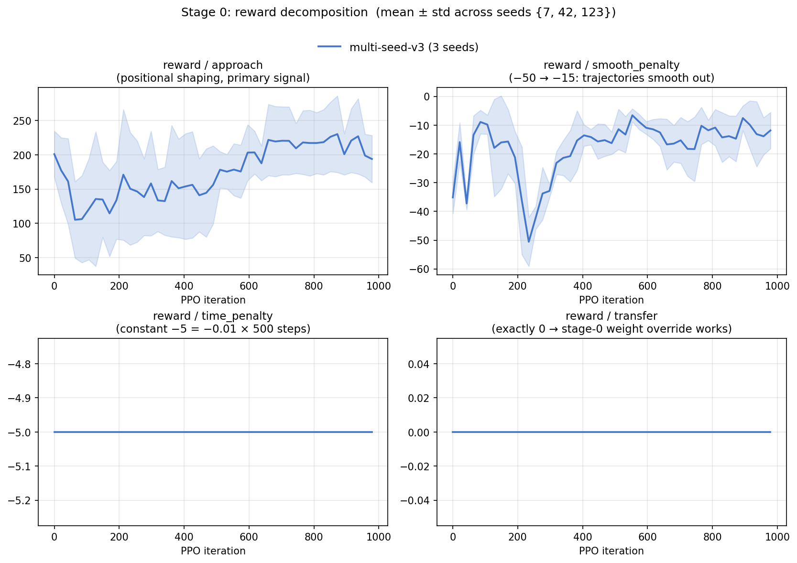
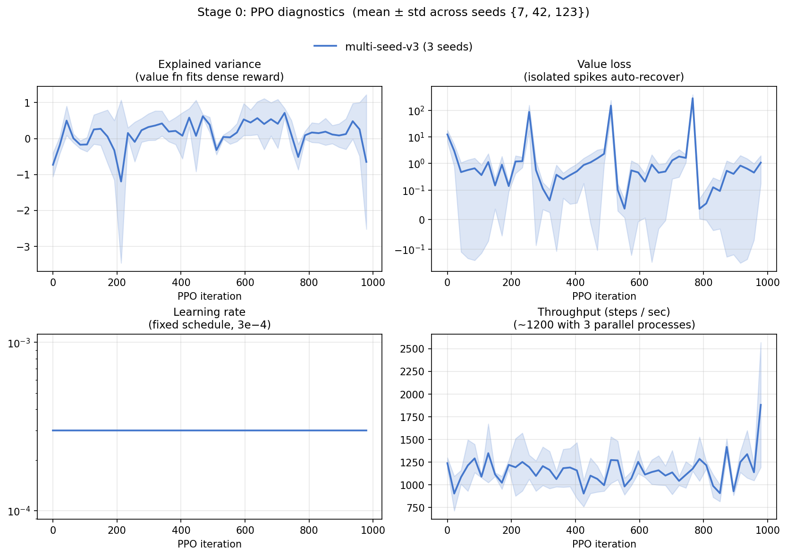

# Stage 0 Results — Appendix

Per-figure analyses, bug catalogue, reproducibility command, and the full "validates / does not validate" breakdown for the Stage 0 pipeline-validation campaign. The README's Stage 0 Results section keeps only the narrative + a single headline figure; everything below is for readers who want to dig in or reproduce.

---

## Reward Used

```
R_t = exp(−2·‖p_EE − p_soil‖)        (positional shaping)
    − 0.01·‖a_t − a_{t−1}‖²          (action smoothness)
    − 0.01                            (per-step time penalty)
```

All other reward components (`bucket_load`, `transport`, `soil_transfer`, `collision`, `joint_limit`, `success_bonus`) are explicitly set to zero, and the curriculum manager is disabled (its default `transfer_weight` would otherwise silently override the stage-0 weights — see bug #1 below). The success threshold is set to an unreachable value (1.01) so that the proxy scene's heuristic `soil_in_target_ratio` cannot accidentally trigger early termination.

---

## Reward Decomposition



The non-`approach` reward components (`transport`, `transfer`, `success_bonus`) remain exactly **0** across all 1 000 iterations and all 3 seeds, confirming that the stage-0 reward override now applies correctly. `time_penalty` stays at the constant cumulative −5 (= −0.01 × 500 steps), confirming no early termination occurs. The `smooth_penalty` improves from approximately −50 to −15 across all seeds, indicating the policy learns smoother joint trajectories as training progresses.

---

## Performance Metrics


`Performance/episodic_length` stays exactly at 500 steps, and `success_rate` / `soil_transfer_ratio` remain at 0 by design (the simplified reward does not include success). `episodic_return` rises across all 3 seeds, with final-100-iter averages of approximately 150 (seed 7), 220 (seed 123), and 270 (seed 42). The seed-dependent variance is honest: standalone mode is capped at 32 parallel environments, which produces noisier batch reward estimates than the 2 048–4 096 envs used in Stages 1+.

---

## PPO Diagnostic Metrics



`Policy/learning_rate` is constant at 3 × 10⁻⁴ (fixed schedule). `Policy/explained_variance` mostly oscillates in [0, 1] with occasional negative dips that recover within tens of iterations, indicating the value function is correctly fitting the dense reward. `Policy/value_loss` shows a few isolated spikes (peaks below 400) that auto-recover, with no catastrophic divergence. `Policy/fps` averages around 1 200, reflecting the 3-process parallel execution on the 8-vCPU instance.

---

## Bugs Identified and Fixed During Stage 0

The Stage 0 multi-seed runs surfaced two non-obvious bugs in the broader codebase that would have silently corrupted Stages 1+:

1. **Curriculum override masking explicit reward weights.** `CurriculumManager.get_reward_weight_overrides()` returns weight overrides that take precedence over the env's `RewardCfg.weights` inside `compute_reward()`. With curriculum enabled (the default), any explicit weight assignment in user code is silently ignored. Fixed by explicitly disabling the curriculum in Stage 0 (`env_cfg.curriculum.enabled = False`) and documenting this gotcha for Stage 2.
2. **EE z-clamp creating false collisions.** The standalone FK clamps end-effector z to 0.005 m for safety; the original collision check `ee_pos[2] < 0.01` therefore triggered every step, producing a constant −5/step penalty that prevented learning. Fixed by storing the unclamped raw FK z in `_ee_pos_z_raw` and only flagging collision when `raw_z < 0` (true ground penetration).

---

## Reproducibility

```bash
for SEED in 7 42 123; do
    PYTHONUNBUFFERED=1 nohup python -m training.train --stage 0 --wandb \
        --wandb-project excavation-rl \
        --wandb-run-name stage0_v3_seed${SEED} --seed ${SEED} \
        --max-iterations 1000 --wandb-tags multi-seed-v3 \
        > logs/v3_seed${SEED}.log 2>&1 &
done
```

The 3 runs complete in approximately 12 minutes on a `t3.2xlarge` (8 vCPU, 32 GB) instance with no GPU usage (PPO update on the [128, 128] MLP fits in microseconds; the throughput bottleneck is single-threaded numpy in `ExcavationEnv.step`).

---

## What Stage 0 Validates — and What It Doesn't

| ✓ Validated | ✗ Not Validated by Stage 0 |
|---|---|
| PPO training loop, GAE, value/policy losses, gradient clipping | Whether RL can learn the actual excavation skill |
| Custom env API (`reset` / `step` / `info`), observation/action spaces | Realism of soil dynamics or bucket-particle interaction |
| Multi-seed reproducibility of the training stack | The full multi-component reward design |
| wandb logging of 24 metrics (`reward/*`, `Performance/*`, `Policy/*`) | Domain randomization or curriculum behavior |
| Checkpoint save / resume and per-run output isolation | Sample efficiency on the real task |

Stage 0 is a smoke test confirming the training infrastructure is correct; it does not claim that the policy has learned to excavate. That validation comes in Stage 1+ once particle physics constrains the action space and the full reward becomes meaningful.
